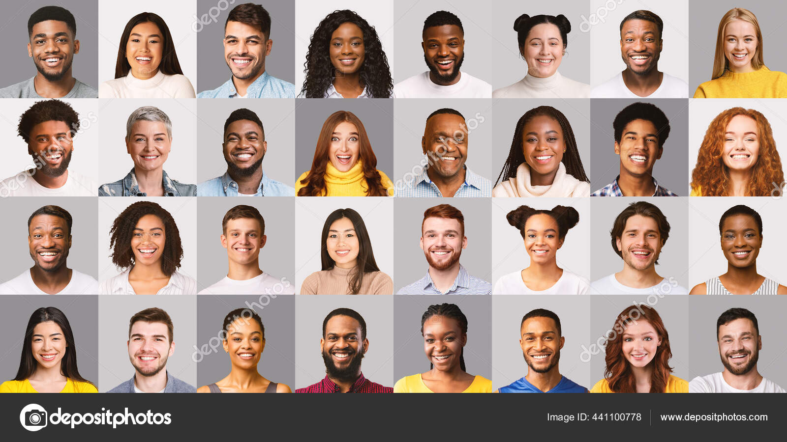
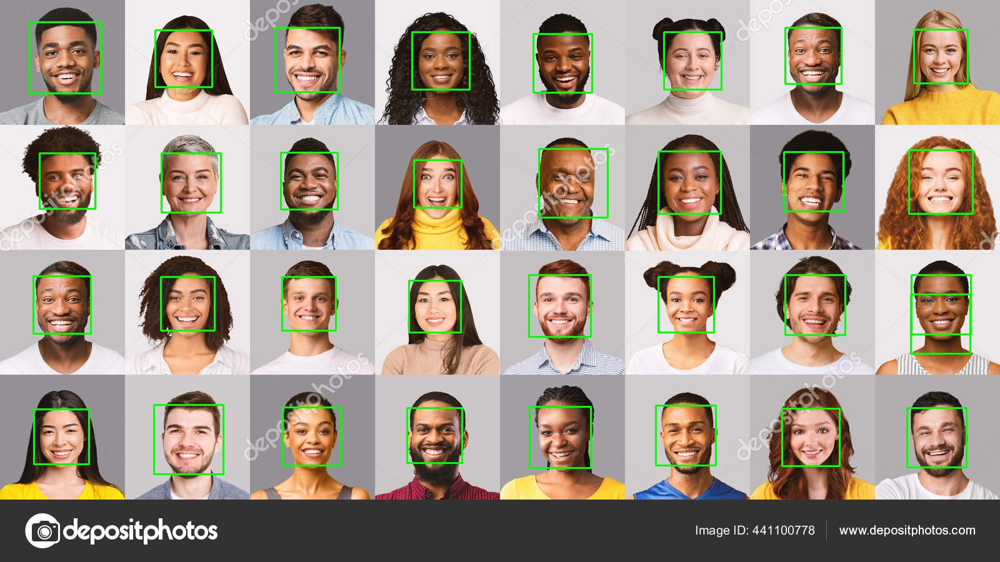

# Face Detection Project

This project detects faces in an image and draws rectangles around detected faces using OpenCV.

## Setup

### Local Setup
1. Clone the repository:
   ```bash
   git clone https://github.com/GuyRaymond/face-detection.git
   cd face-detection
   ```

2. Create a virtual environment:
   ```bash
   python -m venv venv
   source venv/bin/activate # On Windows: venv\Scripts\activate
   ```

3. Install dependencies:
   ```bash
   pip install -r requirements.txt
   ```

4. Run the application:
   ```bash
   python app/main.py
   ````

5. Deactivate a virtual environment:
   ```bash
   deactivate
   ````

### Docker Setup
1. Build the Docker image:
   ```bash
   docker build -t face-detection .
   ```

2. Run the container:
   ```bash
   docker run --rm -v $(pwd)/images:/app/images face-detection
   ```

3. The output image will be saved in the `images/` directory.

### Sample Output
Input Image:


Output Image:

